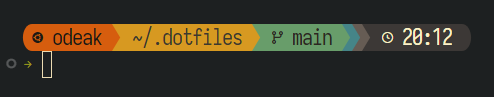

# kev1njodea/dotfiles



Version control for my Linux configuration files using a bare Git repository.

## How-To

- <details>
  <summary><b>Initial commit</b></summary>

  ## Setup Bare Git Repository for Public Repo

  1. **Create a bare repository:**

     ```sh
     git init --bare $HOME/.dotfiles
     ```

  2. **Create an alias to manage the dotfiles:**

     ```sh
     alias dotfiles='git --git-dir=$HOME/.dotfiles/ --work-tree=$HOME'
     ```

  3. **Add the alias to your shell configuration:**

     ```sh
     echo "alias dotfiles='git --git-dir=$HOME/.dotfiles/ --work-tree=$HOME'" >> $HOME/.bashrc
     ```

  4. **Exclude the `.dotfiles` directory from being tracked:**

     ```sh
     echo ".dotfiles" >> $HOME/.gitignore
     ```

  5. **Tell git not to show untracked files**

     ```sh
     dotfiles config --local status.showUntrackedFiles no
     ```

  6. **Ensure sensitive information is not included**


  > [!WARNING]
  > Before committing, check for any sensitive information (e.g., API keys, passwords) and either remove or ignore those files.


  7. **Initial commit:**

     ```sh
     dotfiles add .bashrc .zshrc .vimrc # add others as needed
     dotfiles commit -m "Initial commit of dotfiles"
     dotfiles remote add origin <repo-url>
     dotfiles push -u origin main
     ```

</details>

- <details>
  <summary><b>Following commits</b></summary>

  1. **Example**

     ```sh
     dotfiles status
     dotfiles add .bashrc
     dotfiles commit -m "New alias"
     dotfiles push
     ```

</details>

- <details>
  <summary><b>Starship setup</b></summary>

   1. [Guide](https://starship.rs/guide) / [Config](https://starship.rs/config)

      ```sh
      curl -sS https://starship.rs/install.sh | sh

      echo 'eval "$(starship init bash)"' >> ~/.bashrc

      mkdir -p ~/.config && touch ~/.config/starship.toml
      ```

   2. [Theme - Gruvbox Rainbow](https://starship.rs/presets/gruvbox-rainbow)

      ```sh
      nano ~/.config/starship.toml
      ```

      Paste in configuration, save, open new shell

</details>
